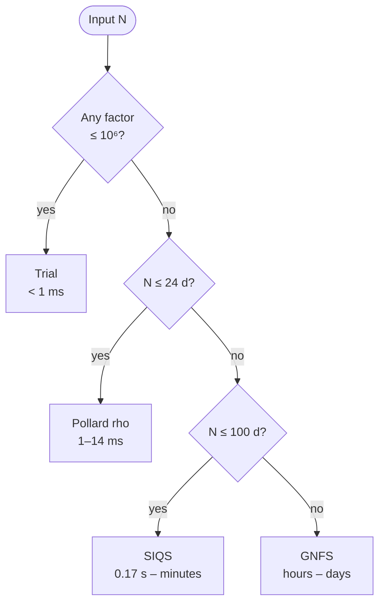
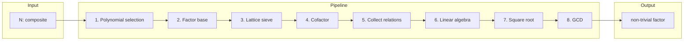

<div align="right"><b>English</b> | <a href="README.md">简体中文</a></div>

<h1 align="center">GNFS</h1>

<p align="center">
  <b>Industrial-grade General Number Field Sieve</b> in C++20, verified up to 65 decimal digits
  <br>
  <sub>The classical algorithm behind every record-breaking RSA factorization</sub>
</p>

<p align="center">
  <a href="https://en.cppreference.com/w/cpp/20"></a>
  <a href="LICENSE"></a>
  
  
  
  
</p>

<p align="center">
  <a href="#quick-start">Quick Start</a> ·
  <a href="#performance">Performance</a> ·
  <a href="#architecture">Architecture</a> ·
  <a href="#runtime-configuration">Runtime Config</a> ·
  <a href="#testing-and-build">Testing & Build</a> ·
  <a href="#contributing">Contributing</a> ·
  <a href="README.md">简体中文</a>
</p>

---

## Overview

The General Number Field Sieve (GNFS) is the asymptotically fastest known classical algorithm for factoring large integers, and it is the method behind every public RSA record (including RSA-768). This project implements the **complete 8-stage GNFS pipeline** in C++20, covering everything from polynomial selection to algebraic square root extraction. It also integrates adaptive method dispatch across trial division, Pollard rho, the Self-Initializing Quadratic Sieve (SIQS), and GNFS itself.

| Metric | Value |
|---|---|
| Largest verified input | 65 decimal digits (213 bits), balanced semiprime, 24 s via SIQS |
| Code footprint | 61 headers, 14 source files, 63 test files, approximately 56,000 lines |
| Concurrency model | Multi-threaded lattice sieve, `ThreadPool`-driven Block Lanczos, parallel Cantor-Zassenhaus |
| Memory scaling | mmap-backed CSR matrices, streaming relation store, Block Wiedemann Krylov mmap, sieve mid-flight checkpoint |
| Platforms | Apple Silicon and x86\_64; macOS 13+ and Linux glibc 2.31+ |

### Design Goals

This project is not an academic prototype. It targets reproducible execution, observability, and scalability at industrial sizes. Three principles run through every module:

1. **Correctness first, speed second.** Every mathematical subroutine ships with a cross-size regression gate (17, 27, 40, and 81 bits). Implementations that pass only at small sizes do not merge to main.
2. **Memory is a first-class resource.** At 50 decimal digits and above, memory pressure dominates before the CPU becomes the bottleneck. The project therefore provides a full out-of-core path that includes streaming relation persistence, Krylov sequence mmap, and sieve mid-flight checkpointing.
3. **Runtime control over algorithm variants.** All experimental strategies hide behind environment variable switches that default to off. This avoids combinatorial algorithm branching and guarantees zero regression risk on the production path.

## Performance

The table below shows measured wall-clock latency in **Release mode** on Apple M1, factoring **balanced semiprimes**. The automatic selection path is trial division (for inputs with small factors), then Pollard rho, then SIQS for inputs between 25 and 100 digits, then GNFS beyond 100 digits.

<table>
<tr><th>Method</th><th>Size</th><th>Time</th><th>Notes</th></tr>
<tr><td rowspan="3"><b>Trial</b><br><sub>O(10⁶)</sub></td>
    <td>3 d / 8 bit</td><td>&lt; 1 ms</td><td>instant</td></tr>
<tr><td>6 d / 17 bit</td><td>&lt; 1 ms</td><td>instant</td></tr>
<tr><td>10 d / 30 bit</td><td>&lt; 1 ms</td><td>small factor present</td></tr>
<tr><td rowspan="3"><b>Pollard rho</b><br><sub>O(N¹ᐟ⁴)</sub></td>
    <td>13 d / 40 bit</td><td>1.6 ms</td><td>balanced</td></tr>
<tr><td>19 d / 61 bit</td><td>2.7 ms</td><td>balanced</td></tr>
<tr><td>22 d / 70 bit</td><td>14 ms</td><td>balanced</td></tr>
<tr><td rowspan="6"><b>SIQS</b><br><sub>O(L_N(½))</sub></td>
    <td>25 d / 81 bit</td><td><b>0.17 s</b></td><td>411 polynomials</td></tr>
<tr><td>39 d / 127 bit</td><td>0.30 s</td><td>2,012 polynomials</td></tr>
<tr><td>49 d / 160 bit</td><td>0.90 s</td><td>9,211 polynomials</td></tr>
<tr><td>55 d / 180 bit</td><td>3.8 s</td><td>32,012 polynomials</td></tr>
<tr><td>59 d / 193 bit</td><td>6.9 s</td><td>97,611 polynomials</td></tr>
<tr><td>65 d / 213 bit</td><td><b>24 s</b></td><td>106,011 polynomials</td></tr>
<tr><td rowspan="3"><b>GNFS</b><br><sub>O(L_N(⅓))</sub></td>
    <td>34 d / 116 bit</td><td>~ 8.9 min</td><td>measured in Debug</td></tr>
<tr><td>45 d / 147 bit</td><td>~ 20 min</td><td>Debug; SIQS is 24 times faster at this size</td></tr>
<tr><td>50 d / 164 bit</td><td>~ 2.6 h</td><td>stress test</td></tr>
</table>

> SIQS dominates GNFS between 25 and 100 digits. The asymptotic advantage of GNFS appears only above 100 digits. The project nevertheless lets you force the GNFS path via `--method gnfs` for algorithmic research and regression coverage.

The automatic selection cascade (top-down first match):



To override the default selection, use `./build/gnfs <N> --method <name>`, where the choices are `auto`, `trial`, `rho`, `siqs`, or `gnfs`.

## Quick Start

### Requirements

- A C++20 compiler (Clang 14+ or GCC 12+)
- CMake 3.20+
- GMP 6.0+ (required)
- pthreads (required)
- NTL (optional, adds extra number-theoretic routines)
- Metal (optional on macOS, reserved for future GPU acceleration)

```bash
# macOS
brew install gmp cmake

# Ubuntu or Debian
sudo apt install libgmp-dev cmake build-essential

# Fedora or RHEL
sudo dnf install gmp-devel cmake gcc-c++

# Arch Linux
sudo pacman -S gmp cmake
```

### Build and First Run

```bash
git clone https://github.com/MaYiding/GNFS.git && cd GNFS

cmake -B build -DCMAKE_BUILD_TYPE=Release
make -C build -j$(nproc 2>/dev/null || sysctl -n hw.ncpu)

./scripts/test.sh                                 # smoke tests, 39 instant tests, about 5 seconds

./build/gnfs 96091                                # automatic method selection
./build/gnfs 1000036000099 --method siqs          # force SIQS
./build/gnfs 1000036000099 --json                 # JSON output
./build/gnfs 1000036000099 --report -o result.txt # detailed report to file
./build/gnfs --interactive                        # REPL mode
```

### CLI Reference

```text
Usage: gnfs <number> [options]

Output:
  --json                  Emit JSON
  --csv                   Emit CSV
  --report                Emit a detailed report with statistics
  -o, --output <file>     Write to file (default: stdout)
  --verbose               Structured verbose logging
  --quiet                 Result only
  --no-color              Disable ANSI colors

Method:
  --method <name>         auto | trial | rho | siqs | gnfs (default: auto)

Language:
  --lang <zh|en>          UI language (default: zh)

Parameter overrides:
  --degree <d>            Polynomial degree
  --fb-rational <n>       Rational factor base bound
  --fb-algebraic <n>      Algebraic factor base bound
  --large-prime <n>       Large prime bound
  --sieve-width <n>       Sieve region width
  --sieve-height <n>      Sieve region height
  --threads <n>           Worker threads

Configuration:
  -c, --config <file>     Load parameters from a key=value config file
  --interactive           Interactive REPL
  -h, --help              Show help
  --version               Show version
```

<details>
<summary><b>Example configuration file (click to expand)</b></summary>

```ini
# gnfs.cfg
method            = auto         # auto | trial | rho | siqs | gnfs
degree            = 4
rational_bound    = 50000
algebraic_bound   = 100000
large_prime_bound = 3000000
threads           = 8
verbose           = true
```
</details>

### C++ API

One-liner:

```cpp
#include <gnfs/api/factorizer.hpp>

auto result = gnfs::api::factorize("1000036000099");
if (result.success) {
    std::cout << result.factors[0].to_string() << " * "
              << result.factors[1].to_string() << "\n";
}

// Custom configuration and explicit method
gnfs::api::Config cfg;
cfg.method  = gnfs::api::FactorizationMethod::SIQS;
cfg.threads = 8;
auto r = gnfs::api::factorize(n, cfg);
std::cout << gnfs::api::method_name(r.stats.method_used) << "\n";
```

Stage-by-stage control:

```cpp
#include <gnfs/api/pipeline.hpp>

gnfs::api::Pipeline pipeline(n, config);
pipeline.set_progress_callback(my_progress_cb);

auto ctx      = pipeline.select_polynomial();
auto fb       = pipeline.build_factor_base(ctx);
auto rels     = pipeline.sieve_and_collect(ctx, fb);
auto filtered = pipeline.filter(std::move(rels));
auto mr       = pipeline.solve_matrix(std::move(filtered), fb, ctx);
auto result   = pipeline.extract_factors(mr, fb, ctx);

const auto& stats = pipeline.stats();
std::cout << "matrix: " << stats.matrix_rows << " x " << stats.matrix_cols << "\n";
```

Result structure:

```cpp
struct FactorResult {
    bool                  success;
    Integer               n;
    std::vector<Integer>  factors;
    FactorStats           stats;

    std::string to_text();    // "N = p * q\nmethod: SIQS | time: 0.9s"
    std::string to_json();    // full JSON
    std::string to_csv();
    std::string to_report();
};
```

## Architecture



### Module Inventory

| Module | Headers | Key components | Responsibility |
|---|:---:|---|---|
| `api/` | 6 | `Factorizer`, `Pipeline`, `Config`, `i18n` | Public interface and bilingual UI |
| `core/` | 6 | `Integer`, `Polynomial`, `Relation`, `Params` | Foundational types and GMP wrappers |
| `polynomial/` | 7 | `Kleinjung`, `Murphy E`, `base-m`, `SelectorDispatch` | Polynomial selection and scoring |
| `factor_base/` | 2 | `FactorBaseBuilder` | Parallel Cantor-Zassenhaus root finding |
| `sieve/` | 5 | `LatticeSieve`, `SpecialQ`, `ecore_qos` | Lattice sieve, bucket sieve, and QoS scheduling |
| `cofactor/` | 5 | `ECM`, `SQUFOF`, `TrialDivider`, `SmoothCheck` | Multi-strategy cofactor factorization |
| `relation/` | 6 | `Collector`, `Filter`, `CliqueRelationMerger`, `OOC` | Thread-safe collection, V0 and V3 cascade merge, streaming persistence |
| `linalg/` | 9 | `BlockLanczos`, `BlockWiedemann`, `SGE`, `MmapCSR`, `KrylovMmap` | GF(2) null space solvers and out-of-core paths |
| `sqrt/` | 7 | `AlgebraicSqrt`, `HenselSqrt`, `Couveignes`, `ClassGroup` | Nguyen Hybrid primary path, Couveignes fallback |
| `siqs/` | 1 | `SIQS` | Contini Self-Initializing Quadratic Sieve for the 25–100 digit band |
| `util/` | 7 | `SmallVector`, `ThreadPool`, `MmapFile`, `SafeMath` | Shared infrastructure |

### Pipeline Stages

| Stage | Algorithm | Key optimizations |
|:---:|---|---|
| 1. Polynomial selection | Kleinjung lattice search and base-m | `SelectorDispatch` chooses by size; Murphy E scoring |
| 2. Factor base | Cantor-Zassenhaus root finding | Multi-threaded; 25-digit factor base drops from 0.31 s to 0.02 s |
| 3. Lattice sieve | Special-Q lattice sieve and bucket sieve | Multi-threaded scatter; `CompactSmallPrime` packs to 12 bytes |
| 4. Cofactor | Trial division, then SQUFOF, then ECM Stage 1+2 | SQUFOF is 10 to 100 times faster than Pollard rho on 2-word cofactors; ECM uses D=2310 |
| 5. Relations | V0 greedy and V3 BFS clique cascade | Adaptive activation; `GNFS_V0_BFS` enables BFS chain merge |
| 6. Linear algebra | SGE preprocessing, then Block Lanczos or Block Wiedemann | SGE reduces matrices by 30–60%; thin matrix BW handles rank-deficient cases |
| 7. Square root | Nguyen Hybrid primary path and Couveignes fallback | K small primes with Hensel lift and CRT, 200 times faster than a large-prime CRT |
| 8. GCD | gcd(a ± b, N) | Falls back to additional dependencies if needed |

> Detailed algorithm notes and recent engineering trade-offs (V0 and V3 cascade, thin BW solve, Schirokauer maps) live in [CLAUDE.md](CLAUDE.md).

### Code Conventions

**Element representation.** This codebase consistently writes algebraic elements as `a - b·α`, **not** `a + b·α`. Changing this convention breaks norm computation, Schirokauer maps, and square root extraction.

**Integer types.** `gnfs::core::Integer` wraps GMP `mpz_class` and carries all big-integer arithmetic. `uint64_t` covers factor base primes and sieve indices. `__uint128_t` holds intermediate products that may overflow `uint64_t`. `Integer` covers higher-precision scenarios such as Hensel lifting.

**Thread safety.** `RelationCollector` combines `std::atomic` counters with thread-local relation buffers. `LatticeSieve::sieve_parallel()` distributes Special-Q primes across worker threads. `BlockLanczos` and `BlockWiedemann` share a `ThreadPool` for parallel sparse matrix-vector multiplication. `FactorBaseBuilder` parallelizes Cantor-Zassenhaus root finding.

**Naming.** Functions and variables use `snake_case`. Types and classes use `PascalCase`. Namespaces follow `gnfs::core`, `gnfs::linalg`, `gnfs::sieve`, and so on.

**Error handling.** Internal logic errors trigger `assert()` or the `GNFS_ASSERT` macro. Recoverable errors return `std::optional` or an error code. Fatal errors throw `std::runtime_error("description")`. Empty `catch` blocks are forbidden.

### Project Layout

```text
GNFS/
├── include/gnfs/           # 61 headers, 11 submodules
│   ├── api/           (6)  # Public API surface
│   ├── core/          (6)  # Foundational types
│   ├── polynomial/    (7)  # Polynomial selection
│   ├── factor_base/   (2)  # Factor base construction
│   ├── sieve/         (5)  # Lattice sieve, bucket sieve, QoS
│   ├── cofactor/      (5)  # Cofactor factorization
│   ├── relation/      (6)  # Relation collection, merging, and OOC
│   ├── linalg/        (9)  # GF(2) solvers, mmap, Krylov
│   ├── sqrt/          (7)  # Square root extraction
│   ├── siqs/          (1)  # SIQS fallback path
│   └── util/          (7)  # Shared utilities
├── src/                    # 14 source files
├── tests/                  # 63 test files
├── scripts/
│   ├── test.sh             # Unified test runner (timeout, tiering, heartbeat)
│   └── feature-branch.sh   # Feature-branch workflow helper
├── docs/                   # Design documents
├── CMakeLists.txt
├── CLAUDE.md               # Engineering doctrine and development notes
├── README.md               # 简体中文
├── README-EN.md            # This file
└── LICENSE                 # GPL-2.0
```

| Category | Files | Lines |
|---|:---:|---:|
| Headers | 61 | ~22,000 |
| Source | 14 | ~6,400 |
| Tests | 63 | ~27,900 |
| **Total** | **138** | **~56,300** |

### References

<details>
<summary><b>Foundational papers and reference implementations (click to expand)</b></summary>

**GNFS foundations**

- Lenstra, A. K., and Lenstra, H. W., editors. *The Development of the Number Field Sieve.* Lecture Notes in Mathematics 1554. Springer, 1993.
- Buhler, J. P., Lenstra, H. W., and Pomerance, C. *Factoring integers with the number field sieve.* Journal of Cryptology 6(2):85–105, 1993.
- Briggs, M. E. *An Introduction to the General Number Field Sieve.* Master's thesis, Virginia Tech, 1998.

**Polynomial selection**

- Kleinjung, T. *On polynomial selection for the general number field sieve.* Mathematics of Computation 75(256):2037–2047, 2006.
- Murphy, B. A. *Polynomial Selection for the Number Field Sieve Integer Factorisation Algorithm.* PhD thesis, Australian National University, 1999.

**Linear algebra**

- Montgomery, P. L. *A block Lanczos algorithm for finding dependencies over GF(2).* Advances in Cryptology, EUROCRYPT '95, pages 106–120, 1995.
- Coppersmith, D. *Solving homogeneous linear equations over GF(2) via block Wiedemann algorithm.* Mathematics of Computation 62(205):333–350, 1994.

**Square root**

- Couveignes, J.-M. *Computing a square root for the number field sieve.* In *The Development of the Number Field Sieve*, pages 95–107, 1993.
- Nguyen, P. Q. *A Montgomery-like Square Root for the Number Field Sieve.* ANTS-III, pages 151–168, 1998.

**Cofactor factorization**

- Lenstra, H. W., Jr. *Factoring integers with elliptic curves.* Annals of Mathematics 126:649–673, 1987.
- Shanks, D. *SQUFOF*, unpublished; see Gower, J. E. *Square form factorization*. PhD thesis, 2004.

**Reference implementations**

- [CADO-NFS](https://cado-nfs.gitlabpages.inria.fr/), the state-of-the-art GNFS implementation maintained by INRIA and LORIA.
- [msieve](https://github.com/radii/msieve), Jason Papadopoulos's integer factorization library.
</details>

## Runtime Configuration

All experimental strategies hide behind environment variable switches. The default off state preserves the standard production path and guarantees zero regression risk. Design rationale, empirical data, and trigger conditions for each switch appear in [CLAUDE.md](CLAUDE.md).

**Filter and merge strategy**

| Variable | Values | Effect |
|---|---|---|
| `GNFS_CASCADE_V3` | `1` / `auto` / unset | Activates the V3 BFS spanning-tree merge for LP keys of weight three or higher; `auto` enables it only from Round 2 onwards |
| `GNFS_V0_BFS` | `1` | Replaces the V0 main path with BFS chain merge; automatically falls back when lp\_bits is at most 20 |
| `GNFS_V0_WEIGHT3` | `1` | V0 Phase 2 merges the first two partials of weight-three LP keys |
| `GNFS_DROP_RESIDUAL` | `1` | Drops relations that retain residual large primes after merging (the 50-digit beta plateau experiment) |
| `GNFS_WEIGHT_CUTOFF` | `N` | Drops relations whose LP key weight exceeds N (the CADO-NFS purge.c approach) |

**Large-scale memory and persistence**

| Variable | Values | Effect |
|---|---|---|
| `GNFS_OOC_RELATIONS` | `1` | Streams relations to `.reldata` and `.relidx` files, which mitigates the 50-digit Round 2 OOM |
| `GNFS_OOC_BASE_PATH` | `<path>` | Overrides the OOC file prefix |
| `GNFS_SIEVE_RESUME` | `<base_path>` | Saves mid-flight sieve checkpoints and resumes OOC append, supporting recovery from multi-hour sieve crashes |
| `GNFS_BW_KRYLOV_MMAP` | `1` | mmaps the Block Wiedemann Phase 1 Krylov sequence to disk and saves about 144 MB at n=1M for the 60-digit case |
| `GNFS_NO_THIN_SOLVE` | `1` | Disables thin matrix BW solve and restores the legacy NO_EXCESS abort behavior |

**Performance and algorithm experiments**

| Variable | Values | Effect |
|---|---|---|
| `GNFS_MURPHY_ALPHA_THREADS` | `N` | Thread count for the Murphy E `compute_alpha` parallel sweep (defaults to hardware concurrency) |
| `GNFS_OVERRIDE_LP_BITS` | `1–30` | Overrides the digit-based lp\_bits default for experiments |

## Testing and Build

The project uses `scripts/test.sh`, which wraps compilation, per-test timeout, tiering, and heartbeat monitoring. The script is pure zsh and does not depend on GNU coreutils.

```bash
./scripts/test.sh                       # smoke: 39 instant tests in about 5 seconds
./scripts/test.sh module linalg         # module-level
./scripts/test.sh changed               # auto-detect via git diff
./scripts/test.sh gate                  # merge gate: smoke plus 17, 27, 40, and 81-bit regression
./scripts/test.sh e2e                   # full GNFS pipeline, about 5 minutes
./scripts/test.sh stress 1 1            # 50-digit stress test, about 2.6 hours
./scripts/test.sh list                  # show all tests, tiers, and timeouts
```

| Tier | Timeout | Count | Scope |
|---|---|:---:|---|
| `instant` | 10 s | 39 | Unit tests across `integer`, `linalg`, `sqrt`, `murphy`, `filter`, `collector`, OOC policy, and more |
| `fast` | 60 s | 1 | `test_sieve_basic` |
| `slow` | 120–300 s | 5 | Regression gate, Kleinjung, lattice sieve, end-to-end, `factor_with_kleinjung` |
| `heavy` | 600–3600 s | 4 | Kleinjung large, 25-digit benchmark, progressive levels L3 to L5 |
| `stress` | 43200 s | 1 | 50-digit (L1) and 60-digit (L2) |

The full subcommand reference appears in [CLAUDE.md](CLAUDE.md#自动化测试工作流-scriptstestsh).

**Build types**

```bash
cmake -B build -DCMAKE_BUILD_TYPE=Debug              # assertions and debug symbols
cmake -B build -DCMAKE_BUILD_TYPE=Release            # O3, LTO, and native CPU flags
cmake -B build -DCMAKE_BUILD_TYPE=RelWithDebInfo     # Release with debug info
```

| CMake option | Default | Description |
|---|:---:|---|
| `GNFS_BUILD_TESTS` | `ON` | Build test executables |
| `GNFS_ENABLE_ASAN` | `OFF` | AddressSanitizer |
| `GNFS_ENABLE_TSAN` | `OFF` | ThreadSanitizer |
| `GNFS_ENABLE_UBSAN` | `OFF` | UndefinedBehaviorSanitizer |

The build system auto-detects GMP (required), NTL (optional), Metal (optional on macOS), native CPU flags (`-mcpu=native` on Apple Silicon and `-march=native` on x86), and either ThinLTO (Clang on macOS) or LTO (GCC) when targeting Release.

## Contributing

Contributions are welcome. Please follow this workflow:

1. Fork the repository and create a feature branch named `feat/YYMMDD-description`. The date prefix format appears in [CLAUDE.md](CLAUDE.md#分支规范).
2. Verify the merge gate passes: `./scripts/test.sh gate` (about 20 seconds).
3. Follow the project conventions: C++20 style, `snake_case` functions, and `PascalCase` types.
4. Open a pull request with a clear description.

The project follows [Conventional Commits](https://www.conventionalcommits.org/):

```text
<type>(<scope>): <short description>

[optional body: explain why, not what]
```

Valid `<type>` values are `feat`, `fix`, `perf`, `refactor`, `test`, `chore`, and `docs`. Valid `<scope>` values are `core`, `polynomial`, `factor_base`, `sieve`, `cofactor`, `relation`, `linalg`, `sqrt`, `util`, `api`, `cli`, and `siqs`.

Branch names follow `<type>/YYMMDD-description`, for example `feat/260519-bucket-sieve`, `fix/260519-hensel-overflow`, `perf/260519-lanczos-simd`, or `exp/260519-neon-sieve`.

---

This project is released under the **GNU General Public License v2.0**. See [LICENSE](LICENSE) for details.
