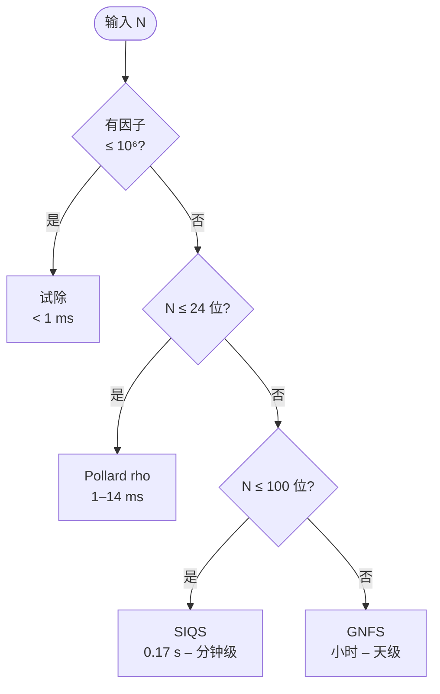

<div align="right"><a href="README-EN.md">English</a> | <b>简体中文</b></div>

<h1 align="center">GNFS</h1>

<p align="center">
  <b>工业级一般数域筛法</b> · C++20 实现 · 已验证至 65 位十进制
  <br>
  <sub>General Number Field Sieve — RSA 破纪录分解背后的经典算法</sub>
</p>

<p align="center">
  <a href="https://en.cppreference.com/w/cpp/20"></a>
  <a href="LICENSE"></a>
  
  
  
  
</p>

<p align="center">
  <a href="#快速开始">快速开始</a> ·
  <a href="#性能数据">性能数据</a> ·
  <a href="#架构">架构</a> ·
  <a href="#运行时配置">运行时配置</a> ·
  <a href="#测试与构建">测试与构建</a> ·
  <a href="#贡献">贡献</a> ·
  <a href="README-EN.md">English</a>
</p>

---

## 概览

GNFS（General Number Field Sieve）是目前已知最强的经典大整数分解算法，RSA-768 等公开破纪录分解均基于该方法。本项目以 C++20 实现了**完整 8 阶段流水线**，覆盖从多项式选择到代数平方根提取的全部环节，并集成了自适应方法分发（试除 / Pollard rho / SIQS / GNFS）。

| 指标 | 数值 |
|---|---|
| 验证规模上限 | 65 位十进制（213 bit）平衡半素数，SIQS 路径 24 秒 |
| 代码规模 | 61 头文件 + 14 源文件 + 63 测试，约 56,000 行 |
| 并行模型 | 多线程格筛、`ThreadPool` 驱动的 Block Lanczos / Cantor-Zassenhaus |
| 内存扩展 | mmap 后端的 CSR 矩阵、关系存储、BW Krylov 序列；筛中检查点 |
| 平台 | Apple Silicon、x86\_64；macOS 13+ 与 Linux glibc 2.31+ |

### 设计目标

本项目并非 GNFS 学术原型，而是面向**可重复执行、可观测、可扩展**的工业级实现。三条核心准则贯穿全部模块：

1. **正确性优先于速度**：每个数学子例程都有跨规模回归（17/27/40/81 bit）门禁，禁止只在小规模 PASS 的实现合入主线。
2. **内存即资源**：50 位及以上规模下内存比 CPU 更早成为瓶颈，因而提供完整的 out-of-core 通道（关系流式持久化、Krylov 序列 mmap、筛法 mid-flight 检查点）。
3. **运行时可控**：所有实验性策略以环境变量开关暴露（默认 OFF），避免「算法分支爆炸」并保证生产路径零回归风险。

## 性能数据

下表为 **Release 模式**在 Apple M1 上对**平衡半素数**的实测时延。自动方法选择路径：试除 →（小因子）Pollard rho →（25–100 d）SIQS →（100 d+）GNFS。

<table>
<tr><th>方法</th><th>规模</th><th>耗时</th><th>备注</th></tr>
<tr><td rowspan="3"><b>试除</b><br><sub>O(10⁶)</sub></td>
    <td>3 d / 8 bit</td><td>&lt; 1 ms</td><td>瞬时</td></tr>
<tr><td>6 d / 17 bit</td><td>&lt; 1 ms</td><td>瞬时</td></tr>
<tr><td>10 d / 30 bit</td><td>&lt; 1 ms</td><td>含小因子</td></tr>
<tr><td rowspan="3"><b>Pollard rho</b><br><sub>O(N¹ᐟ⁴)</sub></td>
    <td>13 d / 40 bit</td><td>1.6 ms</td><td>平衡</td></tr>
<tr><td>19 d / 61 bit</td><td>2.7 ms</td><td>平衡</td></tr>
<tr><td>22 d / 70 bit</td><td>14 ms</td><td>平衡</td></tr>
<tr><td rowspan="6"><b>SIQS</b><br><sub>O(L_N(½))</sub></td>
    <td>25 d / 81 bit</td><td><b>0.17 s</b></td><td>411 个多项式</td></tr>
<tr><td>39 d / 127 bit</td><td>0.30 s</td><td>2,012 个多项式</td></tr>
<tr><td>49 d / 160 bit</td><td>0.90 s</td><td>9,211 个多项式</td></tr>
<tr><td>55 d / 180 bit</td><td>3.8 s</td><td>32,012 个多项式</td></tr>
<tr><td>59 d / 193 bit</td><td>6.9 s</td><td>97,611 个多项式</td></tr>
<tr><td>65 d / 213 bit</td><td><b>24 s</b></td><td>106,011 个多项式</td></tr>
<tr><td rowspan="3"><b>GNFS</b><br><sub>O(L_N(⅓))</sub></td>
    <td>34 d / 116 bit</td><td>~ 8.9 min</td><td>Debug 实测</td></tr>
<tr><td>45 d / 147 bit</td><td>~ 20 min</td><td>Debug；同规模 SIQS 快 24 倍</td></tr>
<tr><td>50 d / 164 bit</td><td>~ 2.6 h</td><td>压力测试</td></tr>
</table>

> 在 25–100 位区间，SIQS 显著优于 GNFS。GNFS 的渐近优势从 100 位以上才开始显现。本项目允许通过 `--method gnfs` 强制走 GNFS 路径以进行算法研究和回归覆盖。

自动选择逻辑（自顶向下首匹配）：



通过 `./build/gnfs <N> --method <name>` 可手动指定，可选值为 `auto` / `trial` / `rho` / `siqs` / `gnfs`。

## 快速开始

### 预编译 CLI 的平台契约

GitHub Release 中的预编译 CLI 采用下列兼容性边界；发布工作流会打开归档并逐项校验，不满足边界时不会发布。

| 归档 | 架构与最低系统 | 动态依赖 |
|---|---|---|
| `gnfs-v0.1.0-linux-x86_64.tar.gz` | x86_64；glibc 2.31+；另需归档内声明的 libstdc++ ABI | GMP、NTL 由主机提供，不随归档分发 |
| `gnfs-v0.1.0-macos-arm64.tar.gz` | Apple Silicon；macOS 13.0+ | GMP、NTL 由主机提供，不随归档分发 |
| `gnfs-v0.1.0-windows-x86_64.zip` | x86_64；MSYS2 UCRT64 | 实际解析到的 UCRT64 DLL 随归档分发 |

Linux 包在 Ubuntu 20.04 容器中使用 GCC 12 构建。发布检查会拒绝高于 `GLIBC_2.31`、`GLIBCXX_3.4.30` 或 `CXXABI_1.3.13` 的符号版本，并拒绝未列入契约的动态库。归档内机器生成的 `binary-compatibility.json` 和 `README-release.txt` 会给出该二进制实际观察到的三个最低 ABI 版本；不能只依据 glibc 版本判断兼容性。macOS 包使用 `CMAKE_OSX_DEPLOYMENT_TARGET=13.0`，同时以 `lipo`、`vtool` 和 `otool` 确认单一 `arm64` 架构及 `minos 13.0`。

每个 CLI 归档根目录都包含本项目的 GPL-2.0 `LICENSE`。Windows 包还包含 `runtime-dependencies.json`、`THIRD_PARTY_NOTICES.txt` 和 `licenses/`；清单固定每个 DLL 的 SHA-256、MSYS2 包名和版本以及对应许可证文件。Linux 与 macOS 包不捆绑 GMP/NTL 动态库，其说明文件会明确这一点。

### 依赖

- C++20 编译器（Clang 14+ 或 GCC 12+）
- CMake 3.20+
- GMP 6.0+（必需）
- pthreads（必需）
- NTL（可选，附加数论例程）
- Metal（macOS 可选，预留 GPU 加速）

```bash
# macOS
brew install gmp cmake

# Ubuntu / Debian
sudo apt install libgmp-dev cmake build-essential

# Fedora / RHEL
sudo dnf install gmp-devel cmake gcc-c++

# Arch Linux
sudo pacman -S gmp cmake
```

### 构建与首次运行

```bash
git clone https://github.com/MaYiding/GNFS.git && cd GNFS

cmake -B build -DCMAKE_BUILD_TYPE=Release
make -C build -j$(nproc 2>/dev/null || sysctl -n hw.ncpu)

./scripts/test.sh                                 # 冒烟测试，运行 instant 层核心测试

./build/gnfs 96091                                # 自动方法选择
./build/gnfs 1000036000099 --method siqs          # 强制 SIQS
./build/gnfs 1000036000099 --json                 # JSON 输出
./build/gnfs 1000036000099 --report -o result.txt # 详细报告
./build/gnfs --interactive                        # REPL 模式
```

### CLI 完整选项

```text
用法: gnfs <数字> [选项]

输出选项:
  --json                  以 JSON 格式输出
  --csv                   以 CSV 格式输出
  --report                输出带统计信息的详细报告
  -o, --output <文件>     输出到文件（默认: stdout）
  --verbose               启用结构化详细日志
  --quiet                 最简输出（仅结果）
  --no-color              禁用 ANSI 颜色

方法选择:
  --method <name>         auto / trial / rho / siqs / gnfs（默认: auto）

语言:
  --lang <zh|en>          UI 语言（默认: zh）

参数覆盖:
  --degree <d>            多项式度数
  --fb-rational <n>       有理因子基界
  --fb-algebraic <n>      代数因子基界
  --lp-bound <n>          大素数界
  --sieve-width <n>       筛区宽度
  --sieve-height <n>      筛区高度
  --threads <n>           本地筛法计算通道预算（非 OS 线程上限）

配置:
  -c, --config <文件>     从 key=value 配置文件加载参数
  --interactive           交互式 REPL 模式
  -h, --help              显示帮助
  --version               显示版本
```

<details>
<summary><b>配置文件示例（点击展开）</b></summary>

```ini
# gnfs.cfg
# method: auto / trial / rho / siqs / gnfs
method            = auto
degree            = 4
rational_bound    = 50000
algebraic_bound   = 100000
large_prime_bound = 3000000
max_special_q_batch_workers = 2
max_local_sieve_threads = 8
verbose           = true
```
</details>

`max_local_sieve_threads` 未配置时使用硬件并发数；显式值会钳制到该上限。Pipeline
在 special-Q 外层 workers 之间均衡分配这些计算通道。详细边界见
[sieve 配置契约](docs/env-flags/sieve.md#special-q-local-compute-budget-config)。

### C++ API

一行调用：

```cpp
#include <gnfs/api/factorizer.hpp>

auto result = gnfs::api::factorize("1000036000099");
if (result.success) {
    std::cout << result.factors[0].to_string() << " * "
              << result.factors[1].to_string() << "\n";
}

// 自定义配置 + 方法选择
gnfs::api::Config cfg;
cfg.method = gnfs::api::FactorizationMethod::GNFS;
cfg.set_max_special_q_batch_workers(2);
cfg.set_max_local_sieve_threads(8);
auto r = gnfs::api::factorize(n, cfg);
std::cout << gnfs::api::method_name(r.stats.method_used) << "\n";
```

逐阶段控制：

```cpp
#include <gnfs/api/pipeline.hpp>

gnfs::api::Pipeline pipeline(n, config);
pipeline.set_progress_callback(my_progress_cb);

auto ctx      = pipeline.select_polynomial();
auto fb       = pipeline.build_factor_base(ctx);
auto reduction = pipeline.sieve_and_collect(ctx, fb);
auto mr        = pipeline.solve_matrix(std::move(reduction), fb, ctx);
auto result   = pipeline.extract_factors(mr, fb, ctx);

const auto& stats = pipeline.stats();
std::cout << "矩阵: " << stats.matrix_rows << " × " << stats.matrix_cols << "\n";
```

结果结构：

```cpp
struct FactorResult {
    bool                  success;
    Integer               n;
    std::vector<Integer>  factors;
    FactorStats           stats;

    std::string to_text();    // "N = p * q\n方法: SIQS | 耗时: 0.9s"
    std::string to_json();    // 完整 JSON
    std::string to_csv_line();
    std::string to_report();
};
```

## 架构


### 模块清单

| 模块 | 头文件 | 核心组件 | 职责 |
|---|:---:|---|---|
| `api/` | 6 | `Factorizer`, `Pipeline`, `Config`, `i18n` | 公开接口层，双语 UI |
| `core/` | 6 | `Integer`, `Polynomial`, `Relation`, `Params` | 基础类型，GMP 封装 |
| `polynomial/` | 7 | `Kleinjung`, `Murphy E`, `base-m`, `SelectorDispatch` | 多项式选择与评分 |
| `factor_base/` | 2 | `FactorBaseBuilder` | 并行 Cantor-Zassenhaus 求根 |
| `sieve/` | 5 | `LatticeSieve`, `SpecialQ`, `ecore_qos` | 格筛 + bucket sieve + QoS 调度 |
| `cofactor/` | 5 | `ECM`, `SQUFOF`, `TrialDivider`, `SmoothCheck` | 多策略余因子分解 |
| `relation/` | 6 | `Collector`, `Filter`, `CliqueRelationMerger`, `OOC` | 线程安全收集 + V0/V3 cascade + 流式持久化 |
| `linalg/` | 9 | `BlockLanczos`, `BlockWiedemann`, `SGE`, `MmapCSR`, `KrylovMmap` | GF(2) 零空间求解 + OOC |
| `sqrt/` | 7 | `AlgebraicSqrt`, `HenselSqrt`, `Couveignes`, `ClassGroup` | Nguyen Hybrid 主路径 + Couveignes 备选 |
| `siqs/` | 1 | `SIQS` | Contini 自初始化二次筛，25–100 d 路径 |
| `util/` | 7 | `SmallVector`, `ThreadPool`, `MmapFile`, `SafeMath` | 通用基础设施 |

### 流水线阶段

| 阶段 | 算法 | 关键优化 |
|:---:|---|---|
| ① 多项式选择 | Kleinjung 格搜索 + base-m | `SelectorDispatch` 按规模分发；Murphy E 评分 |
| ② 因子基 | Cantor-Zassenhaus 求根 | 多线程并行；25 位规模 0.31 s → 0.02 s |
| ③ 格筛 | Special-Q 格筛 + bucket sieve | 多线程 scatter；`CompactSmallPrime` 12 B 紧凑表示 |
| ④ 余因子 | 试除 → SQUFOF → ECM Stage 1+2 | SQUFOF 比 Pollard rho 快 10–100 倍；ECM D=2310 |
| ⑤ 关系收集 | V0 贪心 + V3 BFS clique | 自适应 cascade；`GNFS_V0_BFS` 启用 BFS chain |
| ⑥ 线性代数 | SGE → Block Lanczos / Wiedemann | SGE 缩减 30–60%；thin matrix BW 处理 NO_EXCESS |
| ⑦ 平方根 | Nguyen Hybrid（主） + Couveignes（备选） | K 小素数 + Hensel + CRT，比大素数 CRT 快 200 倍 |
| ⑧ GCD | gcd(a ± b, N) | 多依赖回退 |

> 算法细节与最新工程权衡（V0/V3 cascade、thin BW 解、Schirokauer maps）记录于 [CLAUDE.md](CLAUDE.md)。

### 代码约定

**元素表示**：本代码库基本约定为 `a - b·α`（**非** `a + b·α`）。修改此约定将破坏范数计算、Schirokauer 映射与平方根提取。

**整数类型**：`gnfs::core::Integer` 封装 GMP `mpz_class` 用于所有大整数运算；`uint64_t` 用于因子基素数与筛索引；`__uint128_t` 用于可能溢出的中间乘积；`Integer` 用于 Hensel 提升等更高精度场景。

**线程安全**：`RelationCollector` 使用 `std::atomic` 计数器与线程局部缓冲；`LatticeSieve::sieve_parallel()` 在工作线程间分配 Special-Q 素数；`BlockLanczos` 与 `BlockWiedemann` 共享 `ThreadPool` 进行并行 SpMV；`FactorBaseBuilder` 并行化 Cantor-Zassenhaus 求根。

**命名**：函数与变量 `snake_case`，类型与类 `PascalCase`，命名空间 `gnfs::core` / `gnfs::linalg` / `gnfs::sieve` 等。

**错误处理**：内部逻辑错误用 `assert()` 或 `GNFS_ASSERT` 宏；可恢复错误返回 `std::optional` 或错误码；致命错误 `throw std::runtime_error("描述")`。禁止空 `catch` 块。

### 项目布局

```text
GNFS/
├── include/gnfs/           # 61 个头文件，11 个子模块
│   ├── api/           (6)  # 公开 API 层
│   ├── core/          (6)  # 基础类型
│   ├── polynomial/    (7)  # 多项式选择
│   ├── factor_base/   (2)  # 因子基构建
│   ├── sieve/         (5)  # 格筛 + Bucket + QoS
│   ├── cofactor/      (5)  # 余因子分解
│   ├── relation/      (6)  # 关系收集与合并 + OOC
│   ├── linalg/        (9)  # GF(2) 求解器 + Mmap + Krylov
│   ├── sqrt/          (7)  # 平方根提取
│   ├── siqs/          (1)  # SIQS 备选路径
│   └── util/          (7)  # 工具集
├── src/                    # 14 个源文件
├── tests/                  # 63 个测试文件
├── scripts/
│   ├── test.sh             # 统一测试运行器（超时、分级、心跳）
│   └── feature-branch.sh   # 特性分支工作流
├── docs/                   # 设计文档
├── CMakeLists.txt
├── CLAUDE.md               # 开发指令与工程纪要
├── README.md               # 本文件（中文）
├── README-EN.md            # English
└── LICENSE                 # GPL-2.0
```

| 分类 | 文件 | 行数 |
|---|:---:|---:|
| 头文件 | 61 | ~22,000 |
| 源文件 | 14 | ~6,400 |
| 测试 | 63 | ~27,900 |
| **合计** | **138** | **~56,300** |

### 参考文献

<details>
<summary><b>GNFS 与核心算法（点击展开）</b></summary>

**GNFS 核心**

- Lenstra, A. K., Lenstra, H. W. (eds.). *The Development of the Number Field Sieve*. Lecture Notes in Mathematics 1554, Springer, 1993.
- Buhler, J. P., Lenstra, H. W., Pomerance, C. *Factoring integers with the number field sieve*. Journal of Cryptology 6(2):85–105, 1993.
- Briggs, M. E. *An Introduction to the General Number Field Sieve*. Master's thesis, Virginia Tech, 1998.

**多项式选择**

- Kleinjung, T. *On polynomial selection for the general number field sieve*. Mathematics of Computation 75(256):2037–2047, 2006.
- Murphy, B. A. *Polynomial Selection for the Number Field Sieve Integer Factorisation Algorithm*. PhD thesis, Australian National University, 1999.

**线性代数**

- Montgomery, P. L. *A block Lanczos algorithm for finding dependencies over GF(2)*. Advances in Cryptology — EUROCRYPT '95, pp. 106–120, 1995.
- Coppersmith, D. *Solving homogeneous linear equations over GF(2) via block Wiedemann algorithm*. Mathematics of Computation 62(205):333–350, 1994.

**平方根**

- Couveignes, J.-M. *Computing a square root for the number field sieve*. In *The Development of the Number Field Sieve*, pp. 95–107, 1993.
- Nguyen, P. Q. *A Montgomery-like Square Root for the Number Field Sieve*. ANTS-III, pp. 151–168, 1998.

**余因子分解**

- Lenstra, H. W. Jr. *Factoring integers with elliptic curves*. Annals of Mathematics 126:649–673, 1987.
- Shanks, D. *SQUFOF*, unpublished; 见 Gower, J. E. *Square form factorization*. PhD thesis, 2004.

**参考实现**

- [CADO-NFS](https://cado-nfs.gitlabpages.inria.fr/) — INRIA/LORIA 维护的最先进 GNFS 实现
- [msieve](https://github.com/radii/msieve) — Jason Papadopoulos 的整数分解库
</details>

## 运行时配置

所有实验性策略以环境变量开关暴露，默认 OFF 即标准生产路径，确保零回归风险。各开关的设计动机、实测数据与触发条件详见 [CLAUDE.md](CLAUDE.md) 对应章节。

**过滤合并策略**

| 环境变量 | 取值 | 作用 |
|---|---|---|
| `GNFS_CASCADE_V3` | `1` / `auto` / unset | V3 BFS spanning tree 合并 weight ≥ 3 LP 键；`auto` 仅 Round 2+ 启用 |
| `GNFS_V0_BFS` | `1` | V0 主路径替换为 BFS chain merge（自动 size-gated，lp\_bits ≤ 20 时 fallback） |
| `GNFS_V0_WEIGHT3` | `1` | V0 Phase 2 合并 weight = 3 LP 键的前 2 partials |
| `GNFS_DROP_RESIDUAL` | `1` | 丢弃合并后含残留 LP 的关系（50 d β plateau 实验） |
| `GNFS_WEIGHT_CUTOFF` | `N` | 丢弃 LP 键 weight > N 的关系（CADO-NFS purge.c 思路） |

**大规模内存与持久化**

| 环境变量 | 取值 | 作用 |
|---|---|---|
| `GNFS_OOC_RELATIONS` | `1` | 关系流式写盘（`.reldata` / `.relidx`），50 d Round 2 OOM 缓解 |
| `GNFS_OOC_BASE_PATH` | `<path>` | 覆盖 OOC 文件路径前缀 |
| `GNFS_SIEVE_RESUME` | `<base_path>` | 筛 mid-flight 检查点 + OOC 续写，支持 hours 级 sieve 崩溃恢复 |
| `GNFS_BW_KRYLOV_MMAP` | `1` | BW Phase 1 Krylov 序列 mmap，60 d n=1 M 节省 ~144 MB |
| `GNFS_NO_THIN_SOLVE` | `1` | 关闭 thin matrix BW solve（恢复 NO_EXCESS abort 旧行为） |

**性能与算法实验**

| 环境变量 | 取值 | 作用 |
|---|---|---|
| `GNFS_MURPHY_ALPHA_THREADS` | `N` | Murphy E `compute_alpha` 并行线程数（默认 hardware concurrency） |
| `GNFS_OVERRIDE_LP_BITS` | `1–30` | 覆盖 digit-based lp\_bits 默认值（实验用） |

## 测试与构建

项目使用 `scripts/test.sh` 统一封装编译、超时、分级与心跳监控（zsh 原生实现，不依赖 GNU coreutils）。

```bash
./scripts/test.sh                       # 冒烟：instant 层核心测试
./scripts/test.sh module linalg         # 模块级
./scripts/test.sh changed               # 根据 git diff 自动选择
./scripts/test.sh gate                  # 合并门禁：smoke + 17/27/40/81 bit 回归
./scripts/test.sh e2e                   # 完整 GNFS 流水线
./scripts/test.sh stress 1 1            # 50 位压力测试，~2.6 h
./scripts/test.sh list                  # 查看全部测试、分级、超时
```

| 分级 | 超时 | 数量 | 范围 |
|---|---|:---:|---|
| `instant` | 10–60 s | 118 | 纯单元 / helper correctness，进入跨平台 PR、sanitizer、coverage |
| `fast` | 60–180 s | 16 | 中速集成 / 资源敏感 helper，进入 Release PR 快矩阵 |
| `gate` | 240 s | 1 | 17/27/40/81 bit 回归门禁，进入 Linux Release 深门禁 |
| `slow` | 120–900 s | 8 | 真实 GNFS / API pipeline，进入 Linux Release 深门禁和 nightly |
| `heavy` | 600–3600 s | 2 | Kleinjung large、25 位基准；渐进 L3–L5 属手动 heavy 路径 |
| `bench` | 120–300 s | 3 | informational micro-benchmark，不阻塞 PR |
| `stress` | 43200 s | 1 | 50 位（L1） + 60 位（L2） |

完整测试与 CI 分层规范见 [docs/testing-ci-policy.md](docs/testing-ci-policy.md)。
首个版本采用 exact-SHA 两阶段发布，操作与安全边界见
[docs/releasing.md](docs/releasing.md)。

**构建类型**

```bash
cmake -B build -DCMAKE_BUILD_TYPE=Debug              # 断言 + 调试符号
cmake -B build -DCMAKE_BUILD_TYPE=Release            # O3 + LTO + 原生 CPU
cmake -B build -DCMAKE_BUILD_TYPE=RelWithDebInfo     # Release + 调试信息
```

| CMake 选项 | 默认 | 说明 |
|---|:---:|---|
| `GNFS_BUILD_TESTS` | `ON` | 构建测试可执行文件 |
| `GNFS_ENABLE_ASAN` | `OFF` | AddressSanitizer |
| `GNFS_ENABLE_TSAN` | `OFF` | ThreadSanitizer |
| `GNFS_ENABLE_UBSAN` | `OFF` | UndefinedBehaviorSanitizer |

构建系统自动检测：GMP（必需）、NTL（可选）、Metal（macOS 可选）、原生 CPU 标志（Apple Silicon `-mcpu=native`，x86 `-march=native`）、ThinLTO（Clang/macOS）或 LTO（GCC）。

## 贡献

欢迎贡献。请遵循以下流程：

1. Fork 仓库并创建特性分支：`feat/YYMMDD-描述`（日期前缀格式见 [CLAUDE.md](CLAUDE.md#分支规范)）
2. 确保测试通过：`./scripts/test.sh gate`（合并门禁，约 20 秒）
3. 遵循约定：C++20 风格、`snake_case` 函数、`PascalCase` 类型
4. 提交 PR 并附清晰描述

本项目采用 [Conventional Commits](https://www.conventionalcommits.org/) 提交规范：

```text
<type>(<scope>): <简短描述>

[可选正文：解释 why，而非 what]
```

`<type>` 取值为 `feat` / `fix` / `perf` / `refactor` / `test` / `chore` / `docs`；`<scope>` 取值为 `core` / `polynomial` / `factor_base` / `sieve` / `cofactor` / `relation` / `linalg` / `sqrt` / `util` / `api` / `cli` / `siqs`。

分支命名遵循 `<type>/YYMMDD-描述`，例如 `feat/260519-bucket-sieve`、`fix/260519-hensel-overflow`、`perf/260519-lanczos-simd`、`exp/260519-neon-sieve`。

---

本项目采用 **GNU General Public License v2.0** 许可。详见 [LICENSE](LICENSE)。
