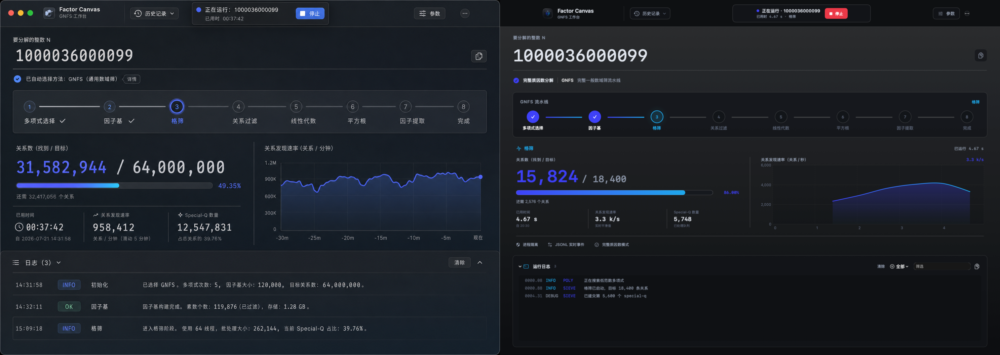

# GNFS Workbench Design QA

## Comparison Scope

- Visual target: direction 2, shown on the left of the comparison.
- Implementation: native SwiftUI live-run dashboard, shown on the right.
- Viewport: `1487 × 1058` logical pixels for both sides.
- State: factoring `1000036000099`, with sieving active, live metrics, chart data, and structured logs visible.
- Rendering path: `NSHostingView` with a Retina backing store. The harness renders fully offscreen and does not take over the desktop.

The source target and final implementation remain available separately:

- [Direction 2](evidence/design-direction-2.png)
- [Final live dashboard](evidence/final-live-dashboard.png)

## Review Rounds

| Round | Priority | Finding | Resolution |
|:---:|:---:|---|---|
| 0 | P1 | The initial implementation was undersized and right-weighted relative to the reference. | Rebuilt the window hierarchy around a custom macOS header, full-width number hero, eight-stage rail, balanced metric and chart regions, and a persistent log surface. |
| 1 | P1 | Primary values, pipeline labels, and logs lacked the reference hierarchy. | Increased the focal-number scale, strengthened active-stage contrast, and tuned spacing at the exact reference viewport. |
| 1 | P2 | The header omitted direct history, parameter, cancellation, rerun, and overflow actions. | Added working native controls with disabled states, help text, keyboard behavior, and accessibility labels. |
| 1 | P2 | The live surface did not communicate process isolation or complete-factorization semantics. | Added protocol, isolation, and complete-mode badges backed by the real child-process invocation. |
| 2 | P2 | The result, history, and parameter surfaces did not expose complete prime factorization clearly enough. | Added exponent-grouped factors, exact-product and primality checks, factor expressions in history, and a locked result-scope explanation in parameters. |
| 3 | P0 | No blocked journey, clipped primary action, or unreadable terminal state remained. | Passed. |
| 3 | P1 | Layout, hierarchy, contrast, and state emphasis matched the selected direction at the design viewport. | Passed. |
| 3 | P2 | Borders, radii, spacing, icon treatment, chart density, and secondary surfaces were internally consistent. | Passed. |

## State Coverage

| Surface | Evidence | Result |
|---|---|:---:|
| Active run | [Live dashboard](evidence/final-live-dashboard.png) | Passed |
| Complete factorization | [Result state](evidence/complete-factorization.png) | Passed |
| Failure at minimum size and large text | [Failure state](evidence/failure-large-text.png) | Passed |
| Local run history | [History popover](evidence/history-popover.png) | Passed |
| Advanced configuration | [Parameter inspector](evidence/parameter-inspector.png) | Passed |

## Functional Design Checks

- The primary input accepts decimal and hexadecimal integers, rejects ambiguous Unicode digits, and explains invalid values inline.
- Every GUI run requests complete prime factorization. The engine recursively splits composite remainders until every returned factor passes its primality check.
- Repeated factors retain multiplicity. For example, `360` renders as `2^3 × 3^2 × 5`; prime input renders as one prime factor.
- A successful result requires complete-factorization and prime-factor flags, plus an exact arbitrary-precision product equal to `N`.
- Method selection, advanced parameters, history, log search and filtering, copy actions, cancellation, and parameter reuse in a new run use working state transitions.
- Live progress comes from versioned JSON Lines events emitted by the bundled engine. The interface does not parse terminal prose.
- The headless suite exercises 31 unit, integration, process, persistence, cancellation, and offscreen rendering checks.
- Screen-driving UI automation remains an explicit fallback and was not used for this review.

final result: passed
